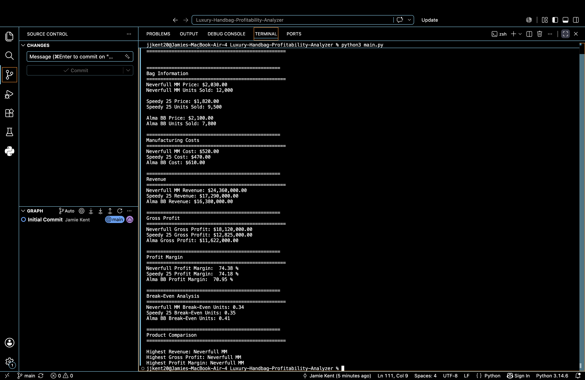

# Luxury Handbag Profitability Analyzer

## Project Overview

This Python project analyzes the profitability of three luxury handbags using hypothetical financial assumptions inspired by luxury fashion brands.

The program compares revenue, manufacturing costs, gross profit, profit margins, and break-even points to determine which handbag performs best financially.

---

## Features

- Calculates total revenue
- Calculates gross profit
- Calculates profit margin
- Calculates break-even units
- Compares three luxury handbags
- Identifies the highest-performing product
- Displays a clean financial report in the terminal

---

## Handbags Analyzed

- Neverfull MM
- Speedy 25
- Alma BB

---

## Technologies Used

- Python 3
- Visual Studio Code
- Git
- GitHub

---

## Financial Metrics

- Revenue
- Manufacturing Cost
- Gross Profit
- Profit Margin
- Break-Even Analysis

---

## Skills Demonstrated

- Financial Analysis
- Python Programming
- Variables
- Mathematical Calculations
- Dictionaries
- Data Comparison
- Formatted Output
- Problem Solving

---

## Example Output

```text
Highest Revenue: Neverfull MM
Highest Gross Profit: Neverfull MM
Highest Profit Margin: Neverfull MM
```

---

## Disclaimer

This project uses hypothetical financial assumptions for educational purposes only. It is not based on confidential or proprietary financial information.

## Program Output


---

## Author

Jamie Kent
